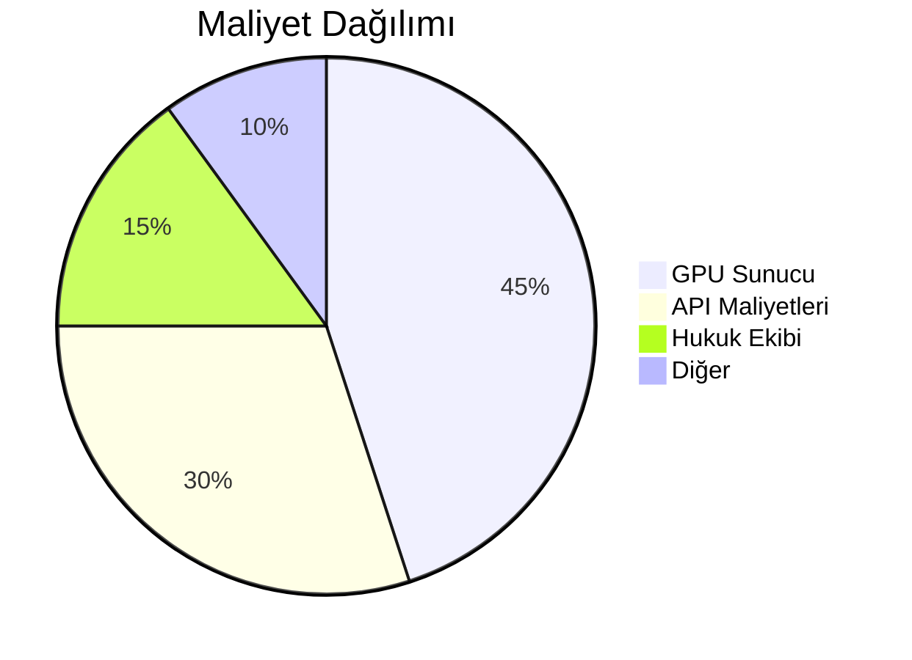

# 📚 AI Destekli Hukuki Danışman Sistemi - Detaylı Proje Planı

## 📌 Proje Özeti
**🔹 Amaç:**  
Hukuki dokümanların otomatik işlenmesi, vektörel benzerlik tabanlı akıllı arama ve doğal dil işleme ile interaktif hukuk danışmanlığı hizmeti sunmak.

**✅ Temel Özellikler:**  
- Dinamik PDF İşleme ve Version Kontrol  
- FAISS ile Optimize Edilmiş Semantik Arama  
- Context-Aware GPT-4 Entegrasyonu  
- Docker ile Mikroservis Mimarisi  
- Gerçek Zamanlı Sohbet Arayüzü  

## 🛠 Teknolojik Altyapı

| Bileşen               | Teknoloji Seçimi                 | Versiyon  |
|-----------------------|----------------------------------|-----------|
| Backend Framework     | FastAPI                          | 0.95+     |
| Frontend              | React + TypeScript               | 18.2+     |
| Vektör Veritabanı     | FAISS                            | 1.7.3+    |
| Embedding Model       | Sentence-BERT (all-mpnet-base-v2)| 2.2.2+    |
| LLM API               | Google Gemini Pro                | v1+       |
| Containerization      | Docker Compose                   | 2.17+     |
| Monitoring            | Prometheus + Grafana             | 3.3+      |

## 🗂 Gelişmiş Dizin Yapısı

```plaintext
hukuki_ai/
├── .github/
│   └── workflows/          # CI/CD Pipeline
├── backend/
│   ├── ai_models/          # Fine-tuned modeller
│   ├── api/                # FastAPI router'lar
│   ├── core/               # Business logic
│   ├── db/                 # Database modülleri
│   └── tests/              | Unit/Integration testler
├── frontend/
│   ├── public/             | Statik asset'ler
│   └── src/
│       ├── api/            | Axios client
│       ├── components/     | UI Bileşenleri
│       └── contexts/       | State yönetimi
├── infrastructure/
│   ├── monitoring/         | Prometheus config'ler
│   └── nginx/              | Reverse Proxy config
└── docs/                   | Swagger & Kullanım Kılavuzu
```

## 🚀 Kritik Geliştirme Adımları

1. **Veri İşleme Pipeline'ı**  
   - [ ] PDF Metadata Extraction  
   - [ ] Otomatik Dil Algılama (NLP)  
   - [ ] Dinamik Cache Invalidation

2. **Vektör Mimarisi**  
   ```python
   class EnhancedVectorDB(VectorDB):
       def __init__(self):
           self.index = faiss.IndexIDMap(faiss.IndexFlatIP(768))
           self.metadata_store = {}
   
       def add_vector(self, vector, metadata):
           vector_id = len(self.metadata_store)
           self.index.add_with_ids(np.array([vector]), np.array([vector_id]))
           self.metadata_store[vector_id] = metadata
   ```

3. **Güvenlik Katmanı**  
   - JWT Authentication  
   - Rate Limiting (10 req/dak)  
   - Input Sanitization Middleware

4. **Performans Optimizasyonu**  
   - Async PDF Processing  
   - FAISS Index Sharding  
   - GPU Acceleration (CUDA)

## 📅 Proje Roadmap

| Faz    | Süre   | Deliverables                  |
|--------|--------|-------------------------------|
| MVP    | 6 Hafta| Temel PDF İşleme + Sohbet API |
| v1.0   | 8 Hafta| Multi-Tenant Destek + Auth    |
| v1.5   | 12 Hafta| Yargıtay Kararları Entegrasyon|

## 🔍 Risk Analizi

| Risk                          | Önleme Stratejisi               |
|-------------------------------|----------------------------------|
| Legal Compliance              | Hukuk Ekibi İş Birliği          |
| API Rate Limits               | Fallback Cache Layer            |
| Model Hallucination           | Confidence Threshold Kontrolü   |

## 💰 Bütçe Planlaması

